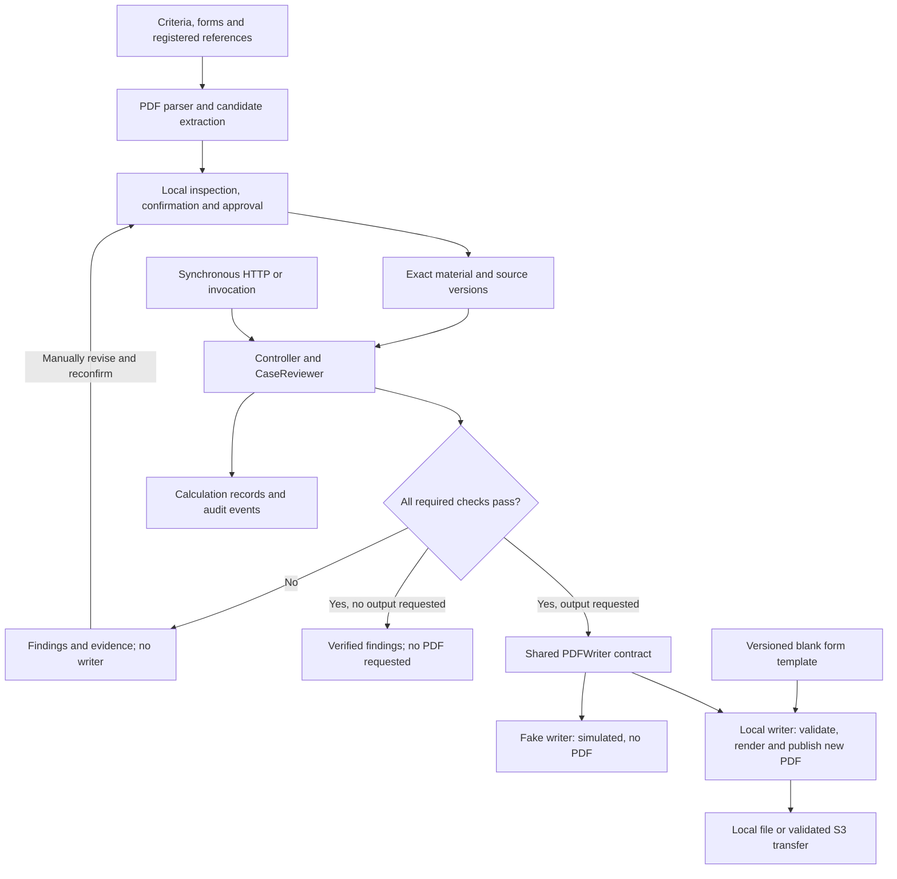

# Agentic AI Real Estate Valuation Reviewer

An evidence-grounded system for reviewing real estate valuation cases. Document
adapters propose case facts and executable rules; reviewers inspect and authorize
the exact material before deterministic code checks grades, correction rates,
original values and cross-form arithmetic. Findings retain their source evidence
and calculation records. A completed or corrected PDF is a planned output through
the shared writer interface; the current fake writer creates no file.

This repository is an engineering baseline for the **2026 New Taipei City AI
Smart City Hackathon** topic, "AI-Assisted Real Estate Valuation Case Review."

## Delivery snapshot

Updated 2026-09-06 after [PR #15](https://github.com/chengruchou/newtaipei-appraisal-review-ai/pull/15)
and [PR #16](https://github.com/chengruchou/newtaipei-appraisal-review-ai/pull/16)
merged into `main`. The merged core is ready for continued integration; live
model, full-case human and cloud acceptance remain open.

| Capability | Repository status | Remaining acceptance |
|---|---|---|
| Shared API, composition and PDF contract | Merged in #10/#13 | Connect production adapters |
| Complete case review and independent calculation | Merged in #15 | Full real-case goldens and domain review |
| PDF parsing, candidate extraction and local reviewer workflow | Merged in #16 | Actual model calls and complete human validation |
| Synthetic Runtime smoke | Preparation merged in #14 | Image build, live invocation and cleanup |
| Formal PDF rendering and storage | Planned in [#5](https://github.com/chengruchou/newtaipei-appraisal-review-ai/issues/5) | Real writer, source snapshot and output validation |
| Durable AWS review jobs | Planned in [#9](https://github.com/chengruchou/newtaipei-appraisal-review-ai/issues/9) | Authorized APIs, persistence, dispatch and recovery |
| Controlled model actions, decision traces and human tasks | Planned in [#17](https://github.com/chengruchou/newtaipei-appraisal-review-ai/issues/17) | Local policy/task contracts, then UI/cloud integration |
| Web review workbench | Planned | Evidence navigation, version-bound responses and downloads |

See [delivery traceability](docs/delivery-traceability.md) for merge SHAs and
historical validation evidence, and the [delivery plan](docs/mvp-plan.md) for
remaining milestones. Merged code and passing tests do not establish full-case
accuracy or deployed service readiness.

## The actual problem

Reviewers currently compare several forms prepared by real estate appraisers
against the evaluation-factor criteria applicable to the case. They verify
source facts and distances, numeric intervals, semantic grades, correction-rate
matrix lookups, subtotals, totals, and values copied between forms. This work is
slow and error-prone, and the applicable criteria can vary by district,
land-use category, effective date, or case.

PDF filling is therefore an output capability, not the whole product. The
primary result is an auditable review that explains what was verified, what
failed, and what still requires a person.

## Design principle

> AI understands documents. Deterministic code performs interval checks,
> correction-rate lookup, arithmetic, validation, and PDF writing.

The system must never invent a missing source value. OCR or model output is
treated as proposed structured data until it passes validation. Free-form LLM
reasoning is never a calculation record and cannot change a finding status.

## Current workflow and output boundary

Review and document-preparation paths come from `main`; this branch adds the
provider-local PDF writer path. Reviewer operations currently run locally. Prepared
material enters through configured adapters, not a client-supplied approval flag.



The current Controller follows a gated workflow. It checks source identity and
purpose, applicability, confidence/confirmation, original cells, all arithmetic
constraints and required coverage. One validated blank candidate may feed later
calculations; conflicting candidates cannot grant completion or writer access.

Model-selected next actions are future #17 work. Application code will define
allowed actions and prerequisites; model proposals will be checked before tool
execution. A model cannot approve material, raise confidence or declare completion.
The future workbench will expose actual action/evidence records and human tasks;
free-form reasoning is not proof of a correct result.

## Stable boundaries

Case-specific policy is data, not Python branching. A rule set declares its
jurisdiction, land-use category, effective dates, source document, numeric or
categorical classifications, and correction matrices. The generic engine then
executes a small supported rule language. A new land-use rule set should
normally require new versioned rule data and boundary tests, not engine code.

Unknown factors, ambiguous applicability, overlapping intervals, unsupported
rule formats, missing evidence, and low-confidence values fail explicitly or
become `needs_review`; they are never mapped to the closest known answer.

See [data contracts](docs/data-contracts.md) for the boundaries and
[architecture](docs/architecture.md) for component responsibilities.

## MVP scope

The first end-to-end MVP intentionally covers five representative factors:

1. Main road width.
2. Average road width within the section.
3. Drainage condition.
4. Terrain condition.
5. Proximity to a traditional market, supermarket, or major shopping center.

Together they exercise numeric and distance intervals, semantic categories,
units, correction matrices, and source-page evidence. The supplied Jinshan
commercial-land criteria are a **case-specific example**, not universal policy.

## Inputs and outputs

Supported local preparation inputs:

- the evaluation-basis PDF applicable to the case;
- one selected valuation forms or case-data PDF, plus registered reference/brief documents;
- configured case identity and source versions; candidate material is inspected,
  confirmed and authorized separately;
- a separately identified blank form template when completed-PDF output is requested;
- optional reviewer-confirmed rule JSON and PDF field maps.

Current results:

- verified facts and inferred classifications kept as distinct values;
- findings with rule IDs, source evidence, warnings, and unresolved items;
- deterministic calculation traces and an audit log;
- explicit review/artifact status after successful review: `verified/not_requested`
  without an output request; `verified/unavailable` for a requested single-context
  output without a writer; `verified/simulated` for fake output; or
  `verified/unsupported_contexts` for a requested multi-context write. None
  provides a created PDF.

This branch implements the provider-local #5 output core: a new completed or
corrected PDF after successful review, configured field-map lookup and writer
validation. Only a successful real writer can produce `completed/written`; the
original is preserved.

The supplied sample PDFs have no interactive AcroForm fields. The likely MVP
writer uses a configured field-coordinate map. Blank filling, annotation and
correction require distinct operations; overlaying existing text is not correction. An AcroForm adapter can be added for future templates.

The local reviewer workflow requires Linux/macOS POSIX identity and private
storage. Every pair side must have eligible measured/native provenance or a valid
current reviewer confirmation before a receipt can be issued or reused. Receipt
eligibility and complete-case validation remain separate gates. The current CLI
does not provide a multi-user web approval service.

## Current implementation status

Implemented: complete source-grounded case review, local Chinese document
preparation and reviewer controls, legacy sum/equals API, typed factor
interval/category/matrix engine, shared PDF contracts, composition/injection,
synchronous `POST /v1/reviews`, framework-neutral AgentCore-facing invocation,
an explicit local synthetic runner, and a provider-local PDF writer core. The
local writer performs deterministic preflight, cryptographic template and
field-map binding, genuine text correction, image/annotation occupancy checks,
embedded-font filling and annotation, reopen verification, reference-page
preservation checks, protected-input alias checks, and atomic publication. An
injected-client S3 wrapper
downloads into isolated local storage and uploads only a locally validated PDF
with `application/pdf` content type. PDF errors retain findings and prevent
completion; successful metadata and warnings remain in the typed response. A
generated-PDF integration test injects `LocalPDFWriter` through
`ReviewAdapters.pdf_writer` and `build_controller`, proving that a verified run
can publish a real local artifact while blocked runs make zero writer calls.

Not implemented: application runtime selection of the real writer, an approved
production template field map and CJK font, live model/S3 acceptance, production
multi-user approval service, and the deployed asynchronous AWS pipeline (#9).
The composition root does not select the real writer automatically. A synthetic
completed run still uses a fake writer and creates no PDF unless the real writer
is explicitly injected.

See [delivery traceability](docs/delivery-traceability.md) for implementation,
test evidence, ownership and Issue dependencies.

## Repository layout

| Location | Responsibility |
|---|---|
| `src/appraisal_review/api/` | Health, legacy validation and synchronous review HTTP |
| `src/appraisal_review/application/` | Entry/composition, Controller and prepared-material assembly |
| `src/appraisal_review/domain/` | Source/purpose contracts, review, confidence, validated fills and arithmetic |
| `src/appraisal_review/ports/` | Parser, provider, authorization and output interfaces |
| `src/appraisal_review/adapters/local/` | PDF parsing, candidates, approval store, synthetic fixtures and audit |
| `src/appraisal_review/adapters/aws/` | Bedrock adapters; full cloud adapters remain separate work |
| `src/appraisal_review/adapters/aws/agentcore/` | Framework-neutral invocation adapter |
| `src/appraisal_review/document_cli.py` | Local document preparation and reviewer commands |
| `cloud_tests/` | Isolated Runtime HTTP/container/template smoke preparation |
| `infra/cdk/` | Two private versioned S3 buckets and a Cases table definition |
| `configs/`, `examples/`, `tests/` | Example rules, synthetic requests and regression tests |
| `docs/` | Requirements, architecture, contracts, runbooks and delivery evidence |

There is no frontend, production jobs pipeline or formal PDF writer in this
snapshot. See the [component map](docs/architecture.md#module-map) before adding
adapters or shared contracts.

## Local setup

Python 3.11 or newer is required. Use Linux or macOS for local reviewer operations.

```bash
python3 -m venv .venv
source .venv/bin/activate
python3 -m pip install -e '.[dev]'

ruff check .
ruff format --check .
mypy src
PYTHONPATH=src pytest tests cloud_tests
```

Run the local API with explicitly synthetic review adapters:

```bash
RUNTIME_MODE=local SYNTHETIC_DEMO=true uvicorn appraisal_review.api.app:app --host 127.0.0.1 --port 8000
```

Then open `http://127.0.0.1:8000/docs` or request
`http://127.0.0.1:8000/health`.

Without configured adapters and with the default `SYNTHETIC_DEMO=false`, health
and legacy validation remain available, while review requests report a
configuration error. For actual documents, follow the
[local preparation and review runbook](docs/member-a-runbook.md#real-document-preparation-and-review-7).
The `documents` extra installs the parser dependencies; the optional `aws` extra
is needed for an explicitly configured live Bedrock extraction run.

## AWS strategy

Target services are API Gateway + Lambda/FastAPI, private S3 presigned transfers,
SQS + dispatcher, AgentCore Runtime, Bedrock, DynamoDB and CloudWatch. The
organizer supplies required services. Account access, Region, model capabilities
and API quotas still require explicit verification.

The local synchronous review API keeps its semantics. #9 adds asynchronous
review jobs with authorized document references, durable state, idempotency,
leases/recovery and result publication. These jobs endpoints are planned, not
available in the current API. #17 adds version-bound human tasks and controlled
model actions; #9 persists them. Waiting for a reviewer releases execution resources,
and a corrected revision starts an explicitly authorized subsequent run.

The merged invocation adapter and isolated `cloud_tests/` server do not establish
a deployed service. Native PDF content and the Bedrock adapter form the current
document route; verify selected model/language support before live acceptance.

See [architecture](docs/architecture.md) and [cloud smoke plan](docs/aws-smoke-plan.md).

## Reliability and human review

- Preserve raw text, source file, page, coordinates, and confidence.
- Identify the exact rule set and rule for every evaluation.
- Keep verified facts, inferred grades, warnings, and unresolved items distinct.
- Route missing, low-confidence, conflicting, or ambiguous evidence to a person.
- Reject unknown factors and unsupported rule formats explicitly.
- Never mark a case completed while critical validation is unresolved or failed.
- Version rule sets and retain the source-document identity used by each case.
- Restrict case facts/cells to selected forms and rules/applicability to selected
  criteria; registered references may support procedures, not substitute case facts.
- Preserve original observations and scores; revisions invalidate obsolete approvals.

Real appraisal documents are sensitive and must not be committed. See
[data handling](docs/data-handling.md).

## Roadmap

The implementation order and acceptance criteria are maintained in the
[MVP plan](docs/mvp-plan.md). Competition requirements are summarized in
[competition requirements](docs/competition-requirements.md).

## Known limitations

- Example rules and numeric values are engineering fixtures until a domain owner
  verifies them against the applicable source document.
- PDF text extraction alone does not reliably preserve table structure or marks.
- A generic rule language supports known rule shapes; a genuinely new rule shape
  requires an explicit engine extension and tests.
- Human confirmation remains necessary for ambiguous OCR and case exceptions.

## Runnable Member A demonstration

```bash
export PYTHONPATH="$PWD/src"
python -m appraisal_review.demo completed
python -m appraisal_review.demo needs_review
python scripts/http_smoke.py
```

These commands use explicit synthetic fixtures, no AWS credentials and no PDF
creation. See the [runbook](docs/member-a-runbook.md) for HTTP requests, precise
imports, B's injection point and validation commands.
