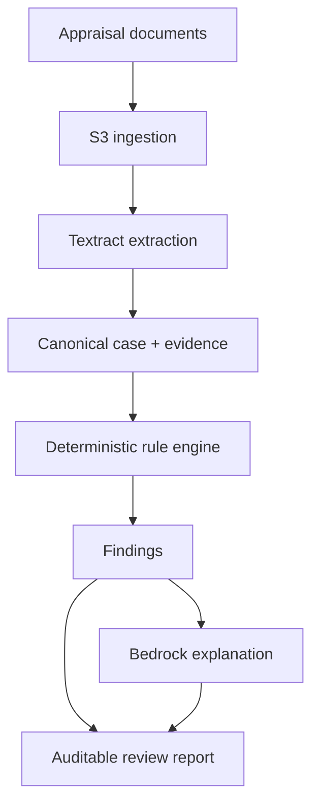

# New Taipei Appraisal Review AI

AWS-native decision support for auditable review of real-estate appraisal
cases. The system extracts evidence from appraisal documents, normalizes fields
across forms, applies deterministic validation rules, and produces findings
that link back to the source document.

This repository is an initial engineering baseline for the **2026 New Taipei
City AI Smart City Hackathon** challenge, "AI-Assisted Review of Real-Estate
Appraisal Cases."

## Design principles

- **Evidence before answers.** Every extracted value carries page, block, and
  confidence metadata.
- **Rules own arithmetic.** Totals, correction rates, and cross-form equality
  are computed by deterministic code, never by a language model.
- **AI assists judgment.** Amazon Bedrock may map unfamiliar labels and explain
  findings, but it does not silently replace source values.
- **Human review is a valid outcome.** Missing, ambiguous, or low-confidence
  evidence becomes `needs_review`, not a fabricated pass or failure.
- **AWS is replaceable at the core boundary.** Domain and validation code run
  locally; Textract, Bedrock, storage, and deployment live behind adapters.

## Architecture



The repository deliberately starts with the canonical data contract and rule
engine. The user interface and asynchronous AWS workflow will be added only
after the official forms and field mappings are confirmed with the domain
owner.

## Repository layout

```text
configs/rules/                 Versioned validation rules
docs/                          Architecture, data, and decision records
infra/cdk/                     Reproducible AWS infrastructure baseline
src/appraisal_review/
  api/                         FastAPI transport layer
  application/                 Review orchestration
  domain/                      Canonical models and rule engine
  ports/                       Provider-neutral interfaces
  adapters/aws/                Textract and Bedrock integrations
  adapters/local/              Offline development adapters
tests/                         Unit tests and synthetic fixtures
```

## Quick start

Python 3.11 or newer is required.

```bash
python -m venv .venv
source .venv/bin/activate
python -m pip install -e '.[dev]'

ruff check .
ruff format --check .
pytest
```

Run the local API:

```bash
uvicorn appraisal_review.api.app:app --reload
```

Then open `http://127.0.0.1:8000/docs` or check:

```bash
curl http://127.0.0.1:8000/health
```

## Configuration

Copy `.env.example` to `.env`. Do not commit AWS credentials. The competition
account, AWS Region, and available Bedrock model ID must be supplied at runtime.

The example rules in `configs/rules/demo.yaml` are **engineering fixtures, not
official appraisal policy**. Production rules must be transcribed from the
case-specific factor table, reviewed by a domain expert, versioned, and tested.

## Data policy

Competition documents and real appraisal cases must not be committed to this
repository. Keep only synthetic or explicitly redistributable fixtures under
`tests/fixtures/`. See [`docs/data-handling.md`](docs/data-handling.md).

## Current status

- Canonical case, evidence, rule, and finding models
- Deterministic `sum` and `equals` checks
- Local JSON validation API
- AWS Textract and Bedrock adapter boundaries
- CDK baseline for encrypted document/result storage and case metadata
- CI for formatting, linting, and tests

See [`docs/architecture.md`](docs/architecture.md) for the planned AWS workflow
and [`docs/roadmap.md`](docs/roadmap.md) for implementation order.
