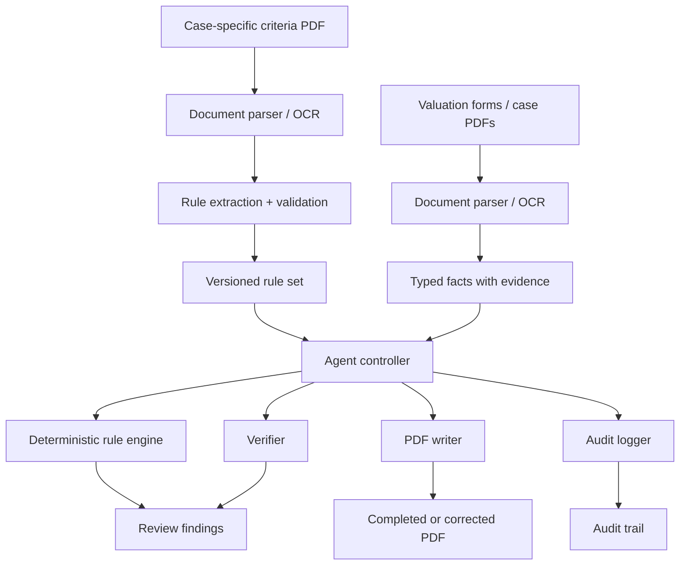

# Agentic AI Real Estate Valuation Reviewer

An evidence-grounded, neuro-symbolic system for reviewing real estate valuation
cases. It reads case-specific evaluation criteria and valuation forms, turns
the criteria into versioned executable rules, verifies factor grades and
correction rates with deterministic code, and produces review findings, an
audit trail, and—when every critical check passes—an optionally completed or
corrected PDF.

This repository is an engineering baseline for the **2026 New Taipei City AI
Smart City Hackathon** topic, "AI-Assisted Real Estate Valuation Case Review."

## The actual problem

Reviewers currently compare several forms prepared by real estate appraisers
against the evaluation-factor criteria applicable to the case. They verify
source facts and distances, numeric intervals, semantic grades, correction-rate
matrix lookups, subtotals, totals, and values copied between forms. This work is
slow and error-prone, and the applicable criteria can vary by district,
land-use category, effective date, or case.

PDF filling is therefore an output capability, not the whole product. The
primary result is an auditable review that explains what was verified, what
failed, and what still requires a person.

## Design principle

> AI understands documents. Deterministic code performs interval checks,
> correction-rate lookup, arithmetic, validation, and PDF writing.

The system must never invent a missing source value. OCR or model output is
treated as proposed structured data until it passes validation. Free-form LLM
reasoning is never a calculation record and cannot change a finding status.

## Proposed workflow



The controller is intended to make tool decisions based on rule availability,
confidence, missing evidence, and verification failures. It must not write an
output PDF or mark a case `completed` after a critical failure.

Conceptual tools:

```text
parse_document()
extract_facts()
load_or_build_rules()
evaluate_factors()
verify_results()
write_pdf()
export_audit_log()
```

## Stable boundaries

Case-specific policy is data, not Python branching. A rule set declares its
jurisdiction, land-use category, effective dates, source document, numeric or
categorical classifications, and correction matrices. The generic engine then
executes a small supported rule language. A new land-use rule set should
normally require new versioned rule data and boundary tests, not engine code.

Unknown factors, ambiguous applicability, overlapping intervals, unsupported
rule formats, missing evidence, and low-confidence values fail explicitly or
become `needs_review`; they are never mapped to the closest known answer.

See [data contracts](docs/data-contracts.md) for the boundaries and
[architecture](docs/architecture.md) for component responsibilities.

## MVP scope

The first end-to-end MVP intentionally covers five representative factors:

1. Main road width.
2. Average road width within the section.
3. Drainage condition.
4. Terrain condition.
5. Proximity to a traditional market, supermarket, or major shopping center.

Together they exercise numeric and distance intervals, semantic categories,
units, correction matrices, and source-page evidence. The supplied Jinshan
commercial-land criteria are a **case-specific example**, not universal policy.

## Inputs and outputs

Planned inputs:

- the evaluation-basis PDF applicable to the case;
- one or more valuation form PDFs;
- optional reviewer-confirmed rule JSON and PDF field maps.

Planned outputs:

- verified facts and inferred classifications kept as distinct values;
- findings with rule IDs, source evidence, warnings, and unresolved items;
- deterministic calculation traces and an audit log;
- a new overlaid PDF when verification permits it. The original is preserved.

The supplied sample PDFs have no interactive AcroForm fields. The likely MVP
writer therefore overlays text and marks using a configured field-coordinate
map. An AcroForm adapter can be added for future templates.

## Current implementation status

Implemented and locally testable after installing dependencies:

- strict Pydantic contracts for canonical fields, evidence, rules, and findings;
- legacy deterministic `sum` and `equals` validation;
- a local JSON validation endpoint at `POST /v1/validate`;
- provider-neutral extraction and explanation ports;
- thin Textract and Bedrock adapters;
- CDK data foundations for private versioned S3 storage and DynamoDB case state;
- CI configuration for Ruff, mypy, and pytest.

The repository realignment adds generic contracts and deterministic evaluation
for typed factors, intervals, category mappings, units, correction matrices,
verification gates, audit events, and PDF field maps. These are local core
capabilities, not proof of end-to-end document processing.

Not yet implemented end to end:

- production OCR-to-fact and OCR-to-rule extraction;
- reviewer approval and persistence of candidate rule sets;
- a production PDF overlay writer;
- an asynchronous agent runtime and deployed API;
- complete official factors, UI, benchmarks, and production operations.

## Repository layout

```text
configs/rules/                 Versioned example rules, never universal policy
docs/                          Requirements, architecture, contracts, and MVP plan
infra/cdk/                     Optional AWS data-foundation baseline
src/appraisal_review/
  api/                         FastAPI transport
  application/                 Review orchestration and workflow decisions
  domain/                      Provider-neutral contracts and deterministic logic
  ports/                       Replaceable provider and output boundaries
  adapters/aws/                Optional AWS integrations
  adapters/local/              Offline development adapters
tests/                         Unit tests and synthetic fixtures
```

## Local setup

Python 3.11 or newer is required.

```bash
python3 -m venv .venv
source .venv/bin/activate
python3 -m pip install -e '.[dev]'

ruff check .
ruff format --check .
mypy src
pytest
```

Run the currently implemented local API:

```bash
uvicorn appraisal_review.api.app:app --reload
```

Then open `http://127.0.0.1:8000/docs` or request
`http://127.0.0.1:8000/health`.

## AWS strategy

AWS services are adapters, not domain dependencies. The available competition
account, Region, permissions, quotas, and model IDs must be confirmed before a
deployment architecture is fixed. Candidate services include object storage,
document extraction, model inference, serverless tool endpoints, orchestration,
and observability. The schemas, rule engine, verifier, and tests should remain
runnable without AWS credentials.

The existing CDK stack creates only data foundations; it does not deploy the
review workflow.

## Reliability and human review

- Preserve raw text, source file, page, coordinates, and confidence.
- Identify the exact rule set and rule for every evaluation.
- Keep verified facts, inferred grades, warnings, and unresolved items distinct.
- Route missing, low-confidence, conflicting, or ambiguous evidence to a person.
- Reject unknown factors and unsupported rule formats explicitly.
- Never mark a case completed while critical validation is unresolved or failed.
- Version rule sets and retain the source-document identity used by each case.

Real appraisal documents are sensitive and must not be committed. See
[data handling](docs/data-handling.md).

## Roadmap

The implementation order and acceptance criteria are maintained in the
[MVP plan](docs/mvp-plan.md). Competition requirements are summarized in
[competition requirements](docs/competition-requirements.md).

## Known limitations

- Example rules and numeric values are engineering fixtures until a domain owner
  verifies them against the applicable source document.
- PDF text extraction alone does not reliably preserve table structure or marks.
- A generic rule language supports known rule shapes; a genuinely new rule shape
  requires an explicit engine extension and tests.
- Human confirmation remains necessary for ambiguous OCR and case exceptions.
