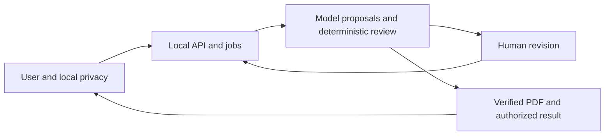
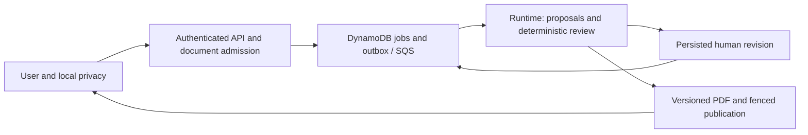

# Architecture

## Current local integration

The configured local composition is merged through PR #45. `main` at `d148422a`
matches the reviewed `fd22e683` source tree. Seven actual core browser/API scenarios
and SQLite process/restart checks passed; the final delivery reports one complete
local privacy restoration/download. OCR reliability and cloud acceptance remain
open. See [project progress](project-progress.md) for current status,
[traceability](delivery-traceability.md) for evidence and
[the backlog](implementation-backlog.md) for remaining implementation.
The earlier component diagrams and deployment snapshots are
[archived](history/2026-09-11-pre-convergence/architecture.md).

The arrows describe the implemented local path, not a claim that every
scenario has passed. The actual implementations and their boundaries are:

| Boundary | Implementation | Integration status |
| --- | --- | --- |
| User/local privacy | Local review SDK, exact export mapping, restoration and page-bound two-stage OCR review; restricted loopback bridge | Complete synthetic restoration/download reported once; repeated reliability remains open |
| API/jobs | `create_integrated_service`, trusted local session directory, C2 admission, job/outbox dispatcher and Runtime worker | Configured local API/worker executes actual cases; no implicit synthetic fallback |
| Durable local state | `SQLiteReviewStore`, `SQLiteResultStore`, immutable revisions and receipt replay | Actual cross-process tests; production/cloud guarantees not implied |
| Proposal/review | Actual PDF parser, authorized extraction snapshots, controlled selector/executor, run ledger, `CaseReviewer` and verifier | Canonical workflow/human adapter and durable run ledger integrated |
| Human revision | #38 authenticated task API and exact subject projection, canonical task fields from #36 | Shared model migration and generated consumer integrated; actual core browser passed |
| PDF/result | Versioned template/map/font registry, multi-context writer, reopen, fenced publication and authorized bytes | Actual service produces complete two-context manifests and authorized bytes |

The source is read again only through approved identities. An authorized
immutable C2 snapshot binds case, document, version/hash and run. A later revision
gets its own current-source check and snapshot; it cannot inherit permission
merely because the previous run had it. Local originals and mapping values never
become accepted cloud payload fields.

## Local privacy and public API separation

The user-side bridge must authenticate its Origin/session, constrain selected
source handles and destinations, and show the exact command/payload before
submission. A browser request cannot choose an arbitrary local path or claim an
actor/role. The application backend accepts authorized document IDs and sanitized
references. It is not a remote file reader for the user's originals.

The mapping is built, encrypted, persisted and read back for the same immutable
export payload the user confirms. Rebuilding a second bundle can change
occurrence IDs and is not equivalent. Key/store/confirmation failure blocks all
transfer. Restore creates another local file; the pristine original and downloaded
placeholder artifact remain unchanged. A revealing writer cannot be wrapped for
publication. The integrated fixture uses a hash-pinned bundled CJK font; this is
not formal asset approval.

Automatic restore still rejects low-confidence OCR and invalid placeholder
inventories. The local visual-review path retains every raw observation and
requires individual readings against the exact viewed page and current stage.
Published-input and restored-candidate stages receive separate local receipts;
neither receipt raises measured confidence or grants business/publication
authority. Changed evidence, session, engine or permission invalidates reuse.
See [local OCR review](local-privacy-ocr-review.md). The one successful complete
run establishes a usable local path; prior 409/timeouts still need diagnosis.

## Workbench and packaging boundary

The current React workbench opens an existing job ID, displays results/tasks and
source PDFs, submits explicit responses, downloads published artifacts, and
exposes the local privacy/OCR review flow. Sign-in uses a manually supplied
session token held for the tab. Job status has a manual refresh; a production
identity flow, job list and general upload/create flow remain work to implement.
The local privacy bridge uses selected source handles rather than accepting
arbitrary remote filesystem paths.

The configured local launcher composes the real service with isolated synthetic
assets. An installed wheel and separately configured container exercised that
composition. `infra/runtime/Dockerfile` supplies the Python runtime entry, not a
complete frontend/API/privacy-bridge stack. Its default
`appraisal_review.adapters.aws.runtime_app:app` has no execution worker and
returns 503; merely copying `runtime.json` does not configure one.

The separate `infra/local-validation` entry serves the built workbench and
configured synthetic API/worker with a private durable volume. The launcher pins
a local Docker Unix endpoint and exposes only numeric loopback addresses. Its
host-companion mode forwards to an explicitly configured host API while the
browser contacts the restricted host privacy bridge directly; original files,
keys and mappings stay on that host. This mode and the standalone synthetic
container have distinct acceptance evidence. See
[local validation](local-validation-stack.md) and ADR 0050.

Production operator provisioning, login and AWS composition remain separate
work. The browser fault-injection proxy remains test infrastructure; the local
container entry does not expose those synthetic recovery controls.

## Transaction and authority boundaries

SQLite local mode uses `BEGIN IMMEDIATE` and freshly loaded typed state for each
operation. A human response commits task state, revision/head, superseded siblings,
job transition, resumed document references, outbox and receipt together. Exceptions
roll back; process death before COMMIT recovers the old state. Cancelling an
awaiting thread-backed operation may leave the outcome unknown, so clients retry
the exact idempotency key/payload rather than infer rollback.

Result candidates are immutable per run/version/attempt. Only a committed
reference's exact digest is readable; a prior attempt's body cannot occupy the
new attempt's candidate slot. Publication checks current run/attempt, owner,
unexpired lease, fence, result-version CAS, cancellation, source binding and
independent grant in its transaction. Local publication/source tables must share
that authority where atomicity is claimed. Artifact-manifest commit and final job
result commit are distinct operations and require recovery if interrupted.

The workflow reservation ledger bounds the whole run across retries/reconstruction.
Unknown external effects retain their reservations and quarantine evidence.
Its own SQLite persistence does not automatically make it atomic with jobs,
publication or traces. The configured integration must define that recovery
boundary explicitly. See [the workflow ledger](workflow-run-ledger.md) and
[local SQLite decision](adr/0030-sqlite-local-review-transactions.md).

## Deterministic completion and human control

AI interprets documents and chooses among allowed actions. Trusted code derives
available actions, budgets, source authority and execution origin. Receipt
validation is part of the protected execution path; malformed receipts produce
failed/quarantined evidence and cannot replay as completed work.

Intervals, units, semantic categories, distance ranges, matrix orientation,
arithmetic and independent verification remain deterministic. Facts include raw
text, measured confidence, page/box evidence and source identity. Missing or
unsupported critical inputs stay `needs_review`. Human confirmation preserves
confidence, including zero, and binds the exact side. Material approval and
publication authorization are independent exact-scope grants, never a side effect
of a correction or a model proposal.

The PDF writer uses a trusted original template and full field map. Every verified
comparison must be covered; only literal `supports_multiple_contexts is True`
enables that path. Measurement and embedding use the same approved immutable font
bytes. Preflight, mutation, reopen and atomic publication all retain source
protection. A blocked review calls no writer. A fake write stays simulated; a
real local PDF alone is not a durable publication grant.

## AWS target: not deployed or accepted by this integration

Existing AWS adapters and infrastructure templates support this target, but the
diagram is not an observed deployment. The durable cloud composition must include
transactional task/revision/outbox effects, current source authorization,
independent grant revocation, attempt-scoped objects, result references and
recovery. Runtime is compute, not a state store. CloudWatch is operational
telemetry, not domain audit; a queue acknowledgement is not completed review.

Competition-specific builders in `adapters/aws/competition_runtime.py` use
`CompetitionAWSClients` to pin the profile/data policy, revalidate current
authority, restrict resources and apply shared physical-dispatch and persistent
conservative budget reservations. A reviewed profile must come from trusted
operator configuration. The checked-in pending profile grants no approval.
Remaining work includes binding the complete discovered destination set and
request region to each selected model in the production path; a standalone
destination-check helper does not enforce that binding. The deployment must also
connect these builders to the authenticated API and complete durable worker.
See [the competition profile](competition-deployment-profile.md) and
[data admission](competition-data-review.md).

Live validation requires a scoped non-root account/role, region, designated model,
budget/data-region authorization, image/package/scan evidence and actual
create/update/rollback, IAM, recovery and alarm observations. Fail-closed 503
behavior without configuration is necessary but does not prove configured success.
See [Runtime operations](runtime-deployment.md), [publication](artifact-publication.md)
and [cloud acceptance](cloud-acceptance.md).

## Contract and module ownership

`domain/service_contracts.py` is the current union model authority and
`domain/task_contracts.py` defines API projections. `controlled-action-v1`
remains separate from service-v1. #38 `HumanTaskService` and #36 controlled local
continuation are different consumers; their receipt/result types are not
interchangeable. The [contract migration matrix](service-contracts.md) assigns
adapters, synchronized consumer regeneration and legacy HTTP regression gates to the
integration owner. The [ADR registry](adr/README.md) gives unique decision IDs
without changing their original approval status.

The selected artifact migration retains legacy `ArtifactManifest` unchanged and
adds `FencedArtifactManifest` (`artifact-manifest-v2`) to the service result union.
The new projection binds primary and complete contexts, fenced publication and
exact digest/font/writer identity. Actual service and regenerated consumers cover
the new manifest; repeated restoration reliability, independent formal approval
and cloud acceptance remain separate gates.
