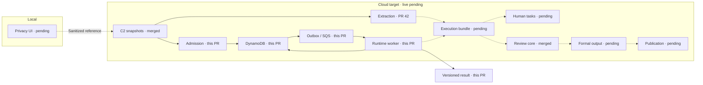
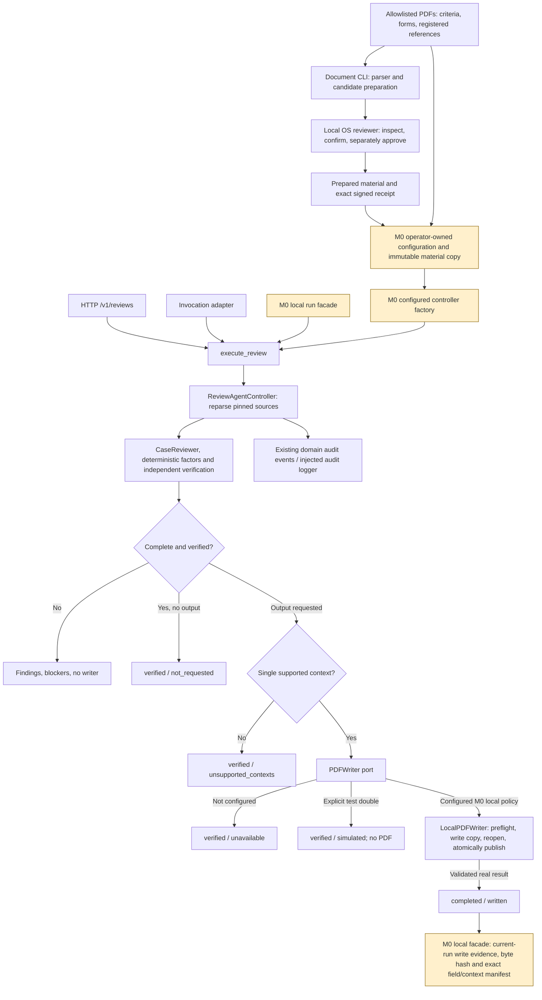
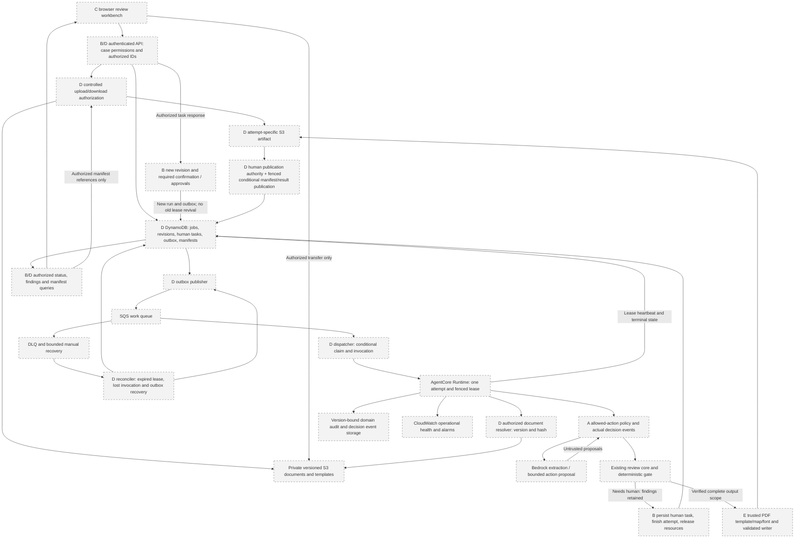

# Architecture

## Integration view, 2026-09-11

Solid edges are implemented adapters, not a deployed topology. Dotted edges
require reviewed integration. The default Runtime has no execution bundle and
returns 503; a durable result is not an authorized published PDF. [Issue 30](issue-30-delivery.md)
records dependency heads, trust boundaries and separate local/container/live gates.
The diagrams below retain earlier baseline detail and the larger target scope.

Snapshot: main `463880af3a6dc6aad2bfa6fdfc3bc267afc4d4a5` inspected on 2026-09-10,
including merged #15/#16/#19/#20/#33. M0 is merged and is not deployed.
[Service contracts](service-contracts.md) define the shared service-v1 DTOs.
[Document transfer](document-transfer.md) adds this branch's controlled C2 ingestion
and immutable source snapshots without changing those DTOs or mounting new HTTP routes.
[Project progress](project-progress.md) records the active work lines.

## Current program structure

Solid lines are implemented calls/data flow. Orange nodes highlight the merged M0
integration. These are local components, not deployed
AWS infrastructure. Prepared material may originate from real/native candidate
adapters or the bounded injected Bedrock adapter; M0 tests make no model calls.

The configured factory injects real LocalPDFParser, MaterialProvider,
LocalApprovalStore and optional confined LocalPDFWriter through existing
ReviewAdapters/build_controller. No second calculation path exists. The service
facade calls the same entry execution; HTTP/invocation keep AgentReviewRun and
EntryProblem. Local service-v1 is a separate boundary, not a hidden v1 migration.
Legacy /health and /v1/validate remain available without a configured review service.

Configuration is explicit and lazy. Importing modules constructs no cloud clients
and reads no documents/fonts. Review-only configuration needs no writer font.
The real writer requires a hash-bound trusted template, full field-map digest,
explicit font and confined output directory. The parser rechecks its allowlisted
source/version/hash and Controller matches the selected criteria/forms to reviewed
material. There is no production synthetic fallback.

Receipt eligibility is distinct from complete review success. Human confirmation
binds an exact side, retains raw confidence and does not approve material. The
Linux/macOS local store verifies the actual OS reviewer and private signed receipt.
M0 revision copies clear confirmations and change the precise case version, making
old receipts unusable. B's future API must derive identity from a trusted adapter,
not request body roles. Windows native reviewer and multi-user login are absent.

The review core handles all comparison contexts. The writer still takes one
FactorReviewResult; no selecting the first comparison. It checks exact field value
refs, pages, bounds, occupancy, font coverage, overflow, correction integrity,
template and full map hashes, protected source URI aliases and final output.
The merged S3 wrapper injects a client and uploads only after local validation;
local/mock tests are not live S3 or Runtime wiring. A local material snapshot and
repeated byte-hash checks are not a continuous immutable source snapshot.

## Target AWS integration (future B/D/A/E work)

Every box in this diagram is a target service or integration duty. Dashed borders
mark pending wiring/deployment, including services with existing adapter or IaC
preparation. No arrow asserts a deployed pipeline.

API Gateway/Lambda/FastAPI is the planned API hosting arrangement. D resolves
storage locations only after authorizing case/document IDs and pinned versions.
A supplies the trusted model/system origin for proposal admission; a body actor
cannot change its budget class. A principal-scoped idempotency key identifies one
canonical payload. The API
persists queued job plus outbox before dispatch; publisher/recovery closes the
DB-to-SQS gap. SQS acceptance is responsibility transfer, not completed review.

Run, attempt and Runtime session have different identities. Runtime acquires a
conditional lease, heartbeats and writes attempt-specific artifacts; only a current
fencing token/result-version CAS can publish a manifest. Recovery reconciles expired
leases, bounded retries and lost acknowledgements. Stale attempts cannot overwrite
new results. HTTP contract/health preparation is in [cloud_tests](../cloud_tests/README.md);
its durable=false session store does not provide any of these guarantees.

Human needs_review persists findings/tasks and ends the attempt. C obtains task
versions/evidence; B authenticates response, rejects stale/conflicting commands and
appends new material with necessary approvals. A subsequent run uses the new revision.
It never waits indefinitely in Runtime, reuses obsolete authority or treats business
needs_review as an infrastructure retry. Bedrock never grants approval or writes
final fields. CloudWatch provides operational telemetry, not domain audit. Runtime
is compute, not the durable state store.

## Preparation versus integration gaps

| Existing component | Remaining work / steward |
| --- | --- |
| infra/cdk private input/result buckets and Cases table definition | D jobs/tasks/outbox/lease model, API/IAM/queues/runtime/publisher/recovery and actual deployment |
| cloud_tests HTTP/container/CloudFormation synthetic smoke | D explicit identity preflight, build/live acceptance/cleanup; full document assembly separately |
| Bounded injected Converse extraction adapter | A permitted action selection, model/prompt trace and comparison against E independent goldens |
| Local real parser/material/approval/writer factory | B web identity/tasks/revisions API; D Runtime adapter wiring |
| Single-context local PDF and injected S3 wrapper | E formal template/font/maps and versioned multiple-context contract; D live transfer/manifests |
| M0 service DTOs, schema/fixtures and pure guards | B/D transactional repositories; C UI; A execution-time policy/event producer |

M0 requires no AWS calls. Later preflight uses designated profile/SSO, Region,
expected account/role and model availability; never chat-delivered access keys.
MCP, a vector database and another orchestration framework are not required here.

## Module map

| Location | Authority |
| --- | --- |
| application/bootstrap.py, entrypoint.py, controller.py | Shared composition/execution and existing review decisions |
| domain/case_review.py, verification.py, review_contracts.py, confidence.py | Deterministic review, independent gates, source/cell and confidence contracts |
| domain/service_contracts.py, application/revisions.py, service_guards.py | M0 shared wire projections, immutable copies and pure checks |
| ports/service.py | Reserved trusted principal/document/revision/task/job adapters |
| adapters/local/service.py, local_service.py | M0 actual configured local assembly and separate envelope |
| document_cli.py, adapters/local/document_manifest.py | Preparation and compatible allowlist manifest imports |
| domain/pdf_models.py, pdf_types.py, ports/pdf.py | Sole PDF request/result/error and writer protocol |
| adapters/local/pdf_writer.py, pdf_overlay.py, pdf_config.py | Local deterministic writing and trusted policy |
| adapters/aws/pdf/s3_pdf_writer.py, storage/s3_object_store.py | Injected-client S3 wrapper; no automatic clients |
| adapters/aws/agentcore/runtime.py | Existing invocation contract |
| schemas/service-v1.json, examples/service-v1/ | Shared consumer schema and illustrative fixtures |

See [milestones](mvp-plan.md), [local acceptance](local-service-runbook.md),
[traceability](delivery-traceability.md) and [ADR 0013](adr/0013-service-foundation.md).
