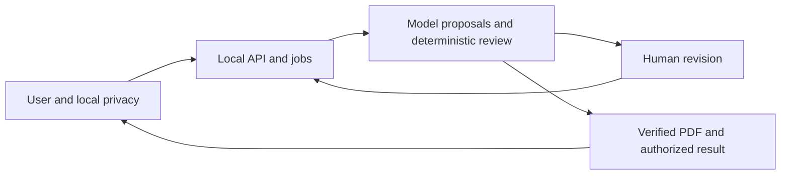
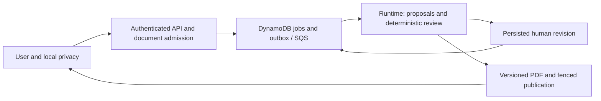

# Architecture

## Current local integration

The local composition is being assembled from implemented components. Component
regressions and SQLite process/restart checks exist; combined browser/service
acceptance is still pending. See [project progress](project-progress.md) for the
single current status and [traceability](delivery-traceability.md) for evidence.
The earlier component diagrams and deployment snapshots are
[archived](history/2026-09-11-pre-convergence/architecture.md).

The arrows describe the local path under integration, not a claim that every
scenario has passed. The actual implementations and their boundaries are:

| Boundary | Implementation | Integration status |
| --- | --- | --- |
| User/local privacy | Local privacy review SDK, exact export mapping and restoration; restricted loopback bridge | Privacy component repair implemented; bridge/browser acceptance is separate |
| API/jobs | `create_integrated_service`, trusted local session directory, C2 admission, job/outbox dispatcher and Runtime worker | Configured composition being integrated; no implicit synthetic fallback |
| Durable local state | `SQLiteReviewStore`, `SQLiteResultStore`, immutable revisions and receipt replay | Actual cross-process tests; production/cloud guarantees not implied |
| Proposal/review | Actual PDF parser, authorized extraction snapshots, controlled selector/executor, run ledger, `CaseReviewer` and verifier | Reused implementation; complete pipeline and recovery being joined |
| Human revision | #38 authenticated task API and exact subject projection, canonical task fields from #36 | Shared model migration and #39 consumer regeneration required |
| PDF/result | Versioned template/map/font registry, multi-context writer, reopen, fenced publication and authorized bytes | Actual writer/adapter regressions; complete service manifest and grant composition under acceptance |

The source is read again only through approved identities. An authorized
immutable C2 snapshot binds case, document, version/hash and run. A later revision
gets its own current-source check and snapshot; it cannot inherit permission
merely because the previous run had it. Local originals and mapping values never
become accepted cloud payload fields.

## Local privacy and public API separation

The user-side bridge must authenticate its Origin/session, constrain selected
source handles and destinations, and show the exact command/payload before
submission. A browser request cannot choose an arbitrary local path or claim an
actor/role. The application backend accepts authorized document IDs and sanitized
references. It is not a remote file reader for the user's originals.

The mapping is built, encrypted, persisted and read back for the same immutable
export payload the user confirms. Rebuilding a second bundle can change
occurrence IDs and is not equivalent. Key/store/confirmation failure blocks all
transfer. Restore creates another local file; the pristine original and downloaded
placeholder artifact remain unchanged. A revealing writer cannot be wrapped for
publication. Synthetic CJK box-glyph fixtures test mapping, not legible formal fonts.

## Transaction and authority boundaries

SQLite local mode uses `BEGIN IMMEDIATE` and freshly loaded typed state for each
operation. A human response commits task state, revision/head, superseded siblings,
job transition, resumed document references, outbox and receipt together. Exceptions
roll back; process death before COMMIT recovers the old state. Cancelling an
awaiting thread-backed operation may leave the outcome unknown, so clients retry
the exact idempotency key/payload rather than infer rollback.

Result candidates are immutable per run/version/attempt. Only a committed
reference's exact digest is readable; a prior attempt's body cannot occupy the
new attempt's candidate slot. Publication checks current run/attempt, owner,
unexpired lease, fence, result-version CAS, cancellation, source binding and
independent grant in its transaction. Local publication/source tables must share
that authority where atomicity is claimed. Artifact-manifest commit and final job
result commit are distinct operations and require recovery if interrupted.

The workflow reservation ledger bounds the whole run across retries/reconstruction.
Unknown external effects retain their reservations and quarantine evidence.
Its own SQLite persistence does not automatically make it atomic with jobs,
publication or traces. The configured integration must define that recovery
boundary explicitly. See [the workflow ledger](workflow-run-ledger.md) and
[local SQLite decision](adr/0030-sqlite-local-review-transactions.md).

## Deterministic completion and human control

AI interprets documents and chooses among allowed actions. Trusted code derives
available actions, budgets, source authority and execution origin. Receipt
validation is part of the protected execution path; malformed receipts produce
failed/quarantined evidence and cannot replay as completed work.

Intervals, units, semantic categories, distance ranges, matrix orientation,
arithmetic and independent verification remain deterministic. Facts include raw
text, measured confidence, page/box evidence and source identity. Missing or
unsupported critical inputs stay `needs_review`. Human confirmation preserves
confidence, including zero, and binds the exact side. Material approval and
publication authorization are independent exact-scope grants, never a side effect
of a correction or a model proposal.

The PDF writer uses a trusted original template and full field map. Every verified
comparison must be covered; only literal `supports_multiple_contexts is True`
enables that path. Measurement and embedding use the same approved immutable font
bytes. Preflight, mutation, reopen and atomic publication all retain source
protection. A blocked review calls no writer. A fake write stays simulated; a
real local PDF alone is not a durable publication grant.

## AWS target: not deployed or accepted by this integration

Existing AWS adapters and infrastructure templates support this target, but the
diagram is not an observed deployment. The durable cloud composition must include
transactional task/revision/outbox effects, current source authorization,
independent grant revocation, attempt-scoped objects, result references and
recovery. Runtime is compute, not a state store. CloudWatch is operational
telemetry, not domain audit; a queue acknowledgement is not completed review.

Live validation requires a scoped non-root account/role, region, designated model,
budget/data-region authorization, image/package/scan evidence and actual
create/update/rollback, IAM, recovery and alarm observations. Fail-closed 503
behavior without configuration is necessary but does not prove configured success.
See [Runtime operations](runtime-deployment.md), [publication](artifact-publication.md)
and [cloud acceptance](cloud-acceptance.md).

## Contract and module ownership

`domain/service_contracts.py` is the current union model authority and
`domain/task_contracts.py` defines API projections. `controlled-action-v1`
remains separate from service-v1. #38 `HumanTaskService` and #36 controlled local
continuation are different consumers; their receipt/result types are not
interchangeable. The [contract migration matrix](service-contracts.md) assigns
adapters, synchronized consumer regeneration and legacy HTTP regression gates to the
integration owner. The [ADR registry](adr/README.md) gives unique decision IDs
without changing their original approval status.

The selected artifact migration retains legacy `ArtifactManifest` unchanged and
adds `FencedArtifactManifest` (`artifact-manifest-v2`) to the service result union.
The new projection binds primary and complete contexts, fenced publication and
exact digest/font/writer identity. Actual service coverage and regenerated
consumers are integration gates; a multi-context writer alone does not satisfy them.
