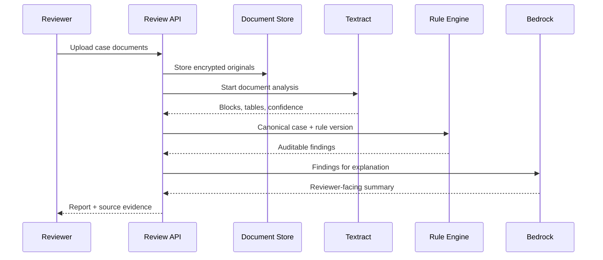

# Architecture

## Logical layers

| Layer | Responsibility | Must not do |
|---|---|---|
| Domain | Canonical case, evidence, rules, findings | Import AWS SDKs |
| Application | Orchestrate extraction, validation, explanation | Hide failed evidence |
| Ports | Define provider-neutral contracts | Contain business rules |
| AWS adapters | S3, Textract, Bedrock, persistence | Decide numeric validity |
| API | Validate input and expose use cases | Embed appraisal policy |

## Planned AWS workflow

Multi-page document analysis is asynchronous. A production implementation
should use Step Functions or an event-driven worker rather than hold an HTTP
request open while Textract runs.

## Canonical boundary

The rule engine consumes `CanonicalCase`, not raw Textract blocks. Template and
label differences are resolved during normalization. This keeps official rules
testable without an AWS account and prevents OCR provider details from leaking
into appraisal logic.

## Trust boundaries

1. OCR is probabilistic; low confidence becomes `needs_review`.
2. Bedrock text is untrusted explanatory output.
3. Deterministic rules are versioned and their inputs remain inspectable.
4. Real documents are stored outside Git and encrypted at rest.
5. The competition AWS account is ephemeral; infrastructure and configuration
   required to rebuild the system live in this repository.

## Deployment stages

- `local`: synthetic canonical JSON, no AWS dependency.
- `sandbox`: team AWS account for adapter and permission tests.
- `competition`: organizer-provided account and approved Region/model IDs.

Account IDs, bucket names, ARNs, and model IDs are runtime configuration, never
hard-coded assumptions.
