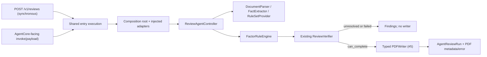
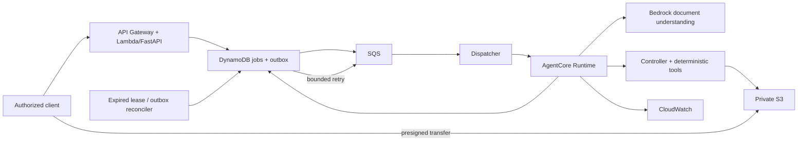

# Architecture and delivery boundaries

The product reviews and assists completion of appraisal forms:
case criteria + forms -> document understanding -> proposed rules and evidenced
facts -> deterministic calculation -> comparison with filled values, sums and
cross-form checks -> findings/human confirmation -> a verified output copy.
AI proposes document interpretations; deterministic code controls decisions and
PDF placement. The present controller is a gated workflow, not yet a dynamic
agent with tool retries and rule approval recovery.

## Implemented entry path (#4, foundation #6)

The HTTP endpoint and invocation adapter validate AgentReviewRequest and serialize
AgentReviewRun, including null values and enum strings. Invalid payloads return
an `invalid_request` error; HTTP uses 422. Configuration errors use 503, execution
errors 500, and all expose sanitized messages. Dependency construction occurs
only after request validation. No cloud SDK or credential discovery at import.

`build_controller(settings, adapters=ReviewAdapters(...))` is the shared
composition root. RUNTIME_MODE is local or aws; unknown modes fail. Required
parser/extractor/provider adapters and mode labels are checked. AWS mode requires
explicit Region/model/storage settings and an AWS adapter bundle; there is no
fallback. Only SYNTHETIC_DEMO=true in local mode installs fixtures. The fixture
parser accepts a fixed URI allowlist and does no file I/O; fake PDF results
include an explicit warning that no file was created.

The legacy /health and /v1/validate endpoints retain their successful response
shape and calculation behavior. Legacy ReviewResult.overall_status is a Python
property, not a serialized field; HTTP findings carry per-check status.

## Honest implementation limits

| Component | Current behavior | Remaining delivery |
|---|---|---|
| Factor engine | Interval/category/unit/matrix calculation | Observed-value review and complete scope: #8 |
| Verifier | Critical factor presence/status and summary status | Independent evidence/identity/math gate: #8 |
| Applicability | Metadata model only | Unique district/category/date/version resolution: #7/#8 |
| Legacy sum/equals | Works in legacy service/API | Connect to new Controller and group/cross-table totals: #8 |
| Bedrock adapter | Explains legacy findings | Facts/rules extraction: #7 |
| PDF | Typed request/result/errors and fake integration | Real rendering and S3 transfer: #5 |
| Entrypoints | Local sync HTTP and invocation adapter | Deployed Runtime and async cloud API: #9 |
| CDK | Two private versioned buckets and case table | Complete cloud pipeline: #9 |

A verified/completed synthetic factor slice does not establish full-case review.
A confirmed baseline verifier weakness is tracked in #8: a fabricated verified
result for the required factor, with unrelated rule/version and an incorrect
rate, still passes its current presence/status gate. A/B do not change that
verifier or audit logger. No production approval claim is made.

## PDF boundary and ownership

See [PDF contract](pdf-contract.md) and ADR 0002. Only verification.can_complete
allows construction of PDFWriteRequest. The controller then checks the typed
result, destination, source page count and exact field set. Warnings/metadata
live in pdf_result, errors in pdf_error; failed writes preserve review findings.
B owns actual page, font, glyph, overflow, correction and atomic publication
checks. Needs-review findings remain available without invoking the completed
form writer. A report PDF would require a separate report-artifact contract.

## Target AWS pipeline (#9; designed, not deployed)

The organizer supplies required AWS services. We prepare this design now;
profile, deployment Region, model permissions and limits still require validation.
No AgentCore Gateway, MCP layer or vector store is required by this path.

- External cloud APIs accept authorized document_id and object version references,
  never file:// or caller-chosen bucket/key. Resolve internal URIs after ownership
  checks. Presigned uploads have bounded size/type/expiry and confirmed ownership.
- POST /v1/review-jobs returns 202 with run_id; status/result routes poll durable
  state. The synchronous /v1/reviews contract is not silently repurposed.
- case_id identifies the case; run_id identifies immutable input/rule versions;
  a UUID Runtime session_id is per attempt. Idempotency key is scoped to principal
  and checked against a canonical payload hash; reuse with different data is 409.
- DynamoDB owns execution state (queued, dispatching, running, succeeded, failed),
  attempt counts, leases and fencing tokens. Controller alone owns business review
  status (needs_review/verified/completed/failed). A succeeded execution can return
  needs_review; neither means a completed PDF exists.
- Persist a job and outbox transaction before dispatch. An outbox reconciler
  recovers the DB/SQS gap. Dispatcher conditionally claims an attempt; duplicates
  do not start another active attempt. A Runtime acceptance response is not final.
- Runtime conditionally acquires the attempt lease, heartbeats, and writes findings
  and optional PDF to attempt-specific objects. It conditionally commits a result
  manifest only with the current fencing token; expose only referenced artifacts.
- Recover lost invocation responses and expired leases through the reconciler,
  with capped attempts, exponential backoff, DLQ and alarms. Stale attempts cannot
  replace newer manifests. Business needs_review is terminal, not a retry trigger.
  SQS messages are acknowledged only after durable responsibility is recorded.
- CloudWatch records run/attempt correlation, latency and sanitized errors, not
  source text or secrets. It does not replace the domain audit trail.

## Verified AWS constraints (2026-09-05)

[HTTP API quotas](https://docs.aws.amazon.com/apigateway/latest/developerguide/http-api-quotas.html)
include a 30-second integration timeout, so long document work uses jobs.
[SQS/Lambda delivery](https://docs.aws.amazon.com/lambda/latest/dg/with-sqs.html)
can be repeated; consumers must be idempotent.

The [Runtime HTTP contract](https://docs.aws.amazon.com/bedrock-agentcore/latest/devguide/runtime-http-protocol-contract.html)
requires ARM64, port 8080, POST /invocations and GET /ping. Background processing
must report HealthyBusy. Use the SDK's task tracking or equivalent custom ping
state with final cleanup, and keep health responsive. See
[long-running tasks](https://docs.aws.amazon.com/bedrock-agentcore/latest/devguide/runtime-long-run.html).
The local invocation adapter by itself is not that server or a deployed Runtime.

[Textract](https://docs.aws.amazon.com/textract/latest/dg/limits-document.html)
and [BDA document inputs](https://docs.aws.amazon.com/bedrock/latest/userguide/bda-limits.html)
do not list Chinese and exclude vertical text. #7 therefore uses native PDF text,
coordinates and Bedrock visual understanding, with selected model capability and
payload-limit verification. Audio language support cannot justify document use.
Model output is a candidate; a trusted approval workflow grants approved status.

See [MVP plan](mvp-plan.md), [traceability](delivery-traceability.md), and
[cloud smoke plan](aws-smoke-plan.md) for acceptance and deployment boundaries.
