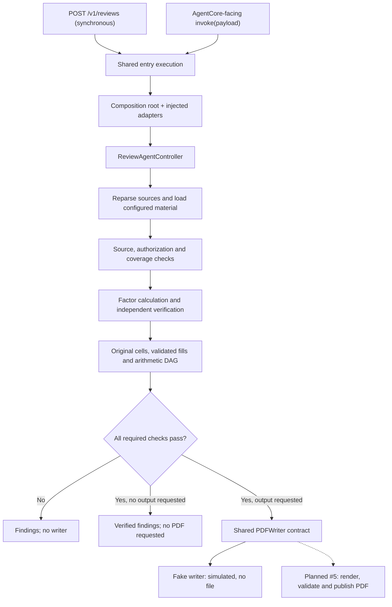
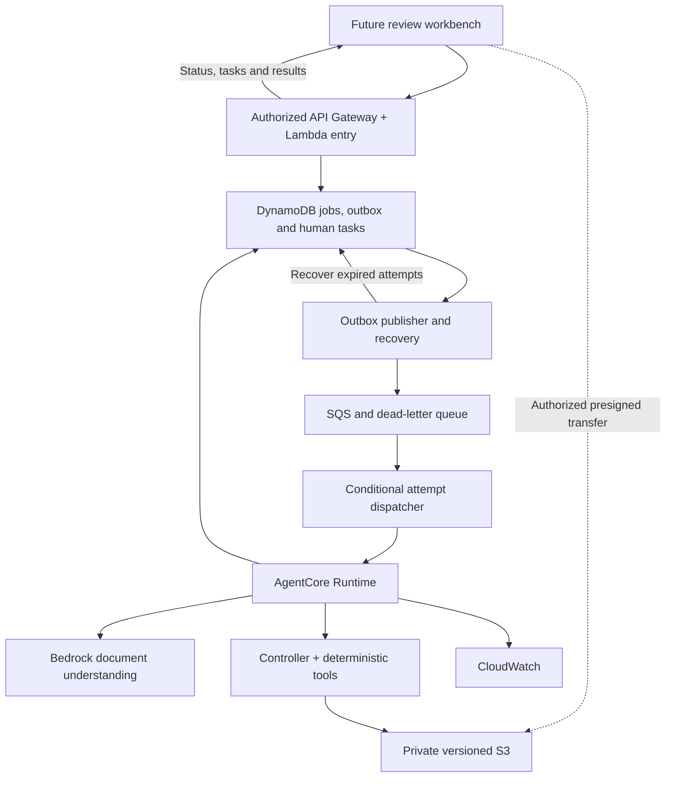
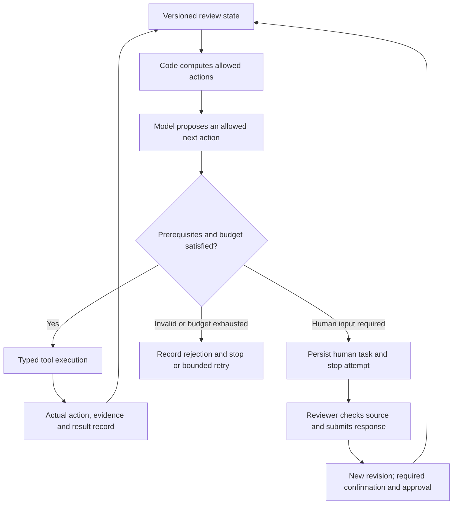

# Architecture and delivery boundaries

Status snapshot: 2026-09-06 after #15 and #16 merged into `main`. The shared entry,
schema-2 review, source-grounded document preparation and local reviewer controls
are implemented. Formal PDF writing (#5), durable jobs (#9), a web workbench and
controlled model action selection (#17) remain planned. Merge SHAs and validation
scope are recorded in [delivery traceability](delivery-traceability.md).

The product reviews and assists completion of appraisal forms:
case criteria + forms -> document understanding -> proposed rules and evidenced
facts -> deterministic calculation -> comparison with filled values, sums and
cross-form checks -> findings/human confirmation -> a verified output copy.
AI proposes document interpretations; deterministic code controls decisions and
PDF placement. The present controller is a gated workflow, not yet a dynamic
agent with tool retries and rule approval recovery.

## Implemented entry and review path (#4/#6/#7/#8)

The HTTP endpoint and invocation adapter validate AgentReviewRequest and serialize
AgentReviewRun, including null values and enum strings. Invalid payloads return
an `invalid_request` error; HTTP uses 422. Configuration errors use 503, execution
errors 500, and all expose sanitized messages. Dependency construction occurs
only after request validation. No cloud SDK or credential discovery at import.

`build_controller(settings, adapters=ReviewAdapters(...))` is the shared
composition root. RUNTIME_MODE is local or aws; unknown modes fail. Required
parser/extractor/provider adapters and mode labels are checked. AWS mode requires
explicit Region/model/storage settings and an AWS adapter bundle; there is no
fallback. Only SYNTHETIC_DEMO=true in local mode installs fixtures. The fixture
parser accepts a fixed URI allowlist and does no file I/O; fake PDF results
include an explicit warning that no file was created.

The legacy /health and /v1/validate endpoints retain their successful response
shape and calculation behavior. Legacy ReviewResult.overall_status is a Python
property, not a serialized field; HTTP findings carry per-check status.

## Review semantics (#8)

Controller accepts typed ReviewPolicy and CaseFacts from the existing provider
ports. CaseReviewer matches exact applicability and current sources, requests
exact-material authorization, evaluates each comparison, compares original
values, runs sum/equals checks and accounts for independent required coverage.
ReviewVerifier independently recomputes claimed factor results. Failed and
needs_review cases retain findings and never invoke the completed-form writer.

Authorization is injected through ReviewAdapters.authorization, separate from
model output and HTTP requests. #7 supplies real parsing, proposed extraction and
a controlled human approval store. The fixed synthetic fixture supplies only its
own predetermined material digests. See ADR 0005 and data-contracts.md.

The controller remains an explicit gated workflow with recorded tool/state
choices; it does not claim dynamic planning or an unbounded model loop.
B's actual PDF writing (#5) and durable AWS jobs (#9) remain separate deliveries.

`ValidatedSlot` separates an original observation, a proposed blank fill and a
trusted value available to later arithmetic. An independent calculation takes
precedence; every applicable constraint must still agree under its declared
rounding/tolerance rules. Without an independent value, constraints must propose
one identical value. Conflicting fills remain unresolved and cannot grant
coverage. Validated blank values can feed the arithmetic DAG without replacing
the original blank or evidence.

Source purpose is checked both during assembly and when prepared material enters
the Controller: selected forms supply case facts, cells and contexts; selected
criteria supply rules and applicability; registered references may support
procedural checks but cannot substitute for case facts. See
[ADR 0009](adr/0009-validated-fill-and-source-purpose.md).

## PDF boundary and ownership

See [PDF contract](pdf-contract.md) and ADR 0002. Only verification.can_complete
allows construction of PDFWriteRequest. The controller then checks the typed
result, destination, source page count and exact field set. Warnings/metadata
live in pdf_result, errors in pdf_error; failed writes preserve review findings.
B owns actual page, font, glyph, overflow, correction and atomic publication
checks. Needs-review findings remain available without invoking the completed
form writer. A report PDF would require a separate report-artifact contract.

Successful review without an output request is `verified/not_requested`. A requested
single-context output without a writer is `verified/unavailable`; the fake writer
returns `verified/simulated`. Multiple comparisons are reviewed together,
but a requested multi-context PDF returns `unsupported_contexts` rather than
silently writing only the first context. `completed/written` requires an actual
validated writer result. Source binding before review is implemented; an immutable
source snapshot through writing/publication remains #5/#9 integration work.

## Target AWS pipeline (#9; designed, not deployed)

The organizer supplies required AWS services. We prepare this design now;
profile, deployment Region, model permissions and limits still require validation.
No AgentCore Gateway, MCP layer or vector store is required by this path.

This diagram is a target, not deployed infrastructure. `infra/cdk/` currently
defines two private versioned S3 buckets and a Cases table. The merged #14 smoke
server has session-local state (`durable=false`); it does not implement these jobs,
human tasks, authorized document APIs or recovery services.

- External cloud APIs accept authorized document_id and object version references,
  never file:// or caller-chosen bucket/key. Resolve internal URIs after ownership
  checks. Presigned uploads have bounded size/type/expiry and confirmed ownership.
- POST /v1/review-jobs returns 202 with run_id; status/result routes poll durable
  state. The synchronous /v1/reviews contract is not silently repurposed.
- case_id identifies the case; run_id identifies immutable input/rule versions;
  a UUID Runtime session_id is per attempt. Idempotency key is scoped to principal
  and checked against a canonical payload hash; reuse with different data is 409.
- DynamoDB owns execution state (queued, dispatching, running, succeeded, failed),
  attempt counts, leases and fencing tokens. Controller alone owns business review
  status (needs_review/verified/completed/failed). A succeeded execution can return
  needs_review; neither means a completed PDF exists.
- Persist a job and outbox transaction before dispatch. An outbox reconciler
  recovers the DB/SQS gap. Dispatcher conditionally claims an attempt; duplicates
  do not start another active attempt. A Runtime acceptance response is not final.
- Runtime conditionally acquires the attempt lease, heartbeats, and writes findings
  and optional PDF to attempt-specific objects. It conditionally commits a result
  manifest only with the current fencing token; expose only referenced artifacts.
- Recover lost invocation responses and expired leases through the reconciler,
  with capped attempts, exponential backoff, DLQ and alarms. Stale attempts cannot
  replace newer manifests. Business needs_review is terminal, not a retry trigger.
  SQS messages are acknowledged only after durable responsibility is recorded.
- CloudWatch records run/attempt correlation, latency and sanitized errors, not
  source text or secrets. It does not replace the domain audit trail.
- #17 defines version-bound human tasks and decisions; #9 persists tasks,
  checkpoints and traces. A review needing a person records its findings and
  releases execution resources. A corrected material revision starts a subsequent
  authorized run; it does not resurrect a stale lease or reuse an old approval.

## Verified AWS constraints (2026-09-05)

[HTTP API quotas](https://docs.aws.amazon.com/apigateway/latest/developerguide/http-api-quotas.html)
include a 30-second integration timeout, so long document work uses jobs.
[SQS/Lambda delivery](https://docs.aws.amazon.com/lambda/latest/dg/with-sqs.html)
can be repeated; consumers must be idempotent.

The [Runtime HTTP contract](https://docs.aws.amazon.com/bedrock-agentcore/latest/devguide/runtime-http-protocol-contract.html)
requires ARM64, port 8080, POST /invocations and GET /ping. Background processing
must report HealthyBusy. Use the SDK's task tracking or equivalent custom ping
state with final cleanup, and keep health responsive. See
[long-running tasks](https://docs.aws.amazon.com/bedrock-agentcore/latest/devguide/runtime-long-run.html).
The local invocation adapter by itself is not that server or a deployed Runtime.

[Textract](https://docs.aws.amazon.com/textract/latest/dg/limits-document.html)
and [BDA document inputs](https://docs.aws.amazon.com/bedrock/latest/userguide/bda-limits.html)
do not list Chinese and exclude vertical text. #7 therefore uses native PDF text,
coordinates and Bedrock visual understanding, with selected model capability and
payload-limit verification. Audio language support cannot justify document use.
Model output is a candidate; a trusted approval workflow grants approved status.

See [MVP plan](mvp-plan.md), [traceability](delivery-traceability.md), and
[cloud smoke plan](aws-smoke-plan.md) for acceptance and deployment boundaries.

## Document preparation and human review (#7)

The implemented local path is allowlisted PDF -> native source registry and
candidate tables -> bounded Bedrock page proposals -> complete reviewed material
-> explicit inspection/confirmation -> separate local approval -> Controller.
Native candidates can be prepared without AWS. The Bedrock client, model and Region remain explicit;
Chinese document accuracy requires opt-in testing in the designated account.
Prepared material is injected through MaterialProvider/ReviewAdapters, and the
Controller re-parses source versions before returning whole-case findings.

No real source content is committed. Run artifacts and manual golden subsets live
under ignored artifacts directories. The current local checks cover native text,
selection symbols, two road matrices and refusal of incomplete/unapproved cases;
they are not full semantic accuracy evidence. See ADR 0006 and the runbook.

## Reviewer trust corrections

ADR 0009 defines a single validated fill candidate and source-purpose restrictions
for selected case documents. Assembly quarantines invalid proposal uses in explicit
unresolved entries, and CaseReviewer repeats the checks for direct prepared input.
LocalApprovalStore admits only eligible native measurements or completely confirmed
sides; full-case review remains a separate completion gate. This local reviewer
workflow requires Linux/macOS POSIX identity/private permissions. Generic help is
platform-neutral; Windows native approval and ACL support are not implemented.

## Controlled actions and web human review (#17; planned)

The application will compute allowed actions from verified workflow state and
prerequisites. A model may choose among those actions; code validates its choice
before invoking a typed tool. The model cannot approve material, increase original
confidence, bypass missing evidence or request publication before the completion
gate. Retry, step and model-call budgets bound the workflow.

Decision records should explain which permitted action was executed, its input
versions, evidence, outcome and remaining blockers. They do not claim access to a
model's private reasoning or treat free-form reasoning as proof of correctness.
The workbench must show original values, proposals and corrections separately,
with source-page navigation. Human responses bind reviewer, task and exact material
version; observation confirmation, rule/material approval and final publication
are distinct permissions and events.

The current CLI and audit events are foundations, not this complete service. See
[issue #17](https://github.com/chengruchou/newtaipei-appraisal-review-ai/issues/17)
and the proposed [parallel workstreams](mvp-plan.md#parallel-workstreams).

## Module map

Paths below are relative to `src/appraisal_review/` unless explicitly marked.

| Location | Current responsibility |
|---|---|
| `api/`, `application/entrypoint.py`, `application/bootstrap.py` | HTTP contracts, shared entry execution and dependency composition |
| `adapters/aws/agentcore/runtime.py` | Framework-neutral invocation adapter |
| `application/controller.py` | Source/material binding, review orchestration and output gate |
| `domain/case_review.py`, `domain/fill_candidates.py` | Whole-case checks, validated slots and arithmetic dependencies |
| `domain/source_purpose.py`, `domain/confidence.py` | Source-use restrictions and confidence/confirmation policy |
| `domain/factor_engine.py`, `domain/verification.py` | Deterministic calculation and independent recomputation |
| `adapters/local/pdf_parser.py`, `adapters/local/native_candidates.py` | Allowlisted PDF text/regions and conservative native candidates |
| `adapters/aws/document_extraction.py` | Bounded Bedrock document proposals; live accuracy remains unvalidated |
| `application/document_review.py`, `document_cli.py` | Prepared-material assembly, inspection and reviewer commands |
| `adapters/local/approval.py`, `adapters/local/reviewer_platform.py` | Exact-material receipts and Linux/macOS reviewer identity controls |
| `domain/pdf_models.py`, `ports/pdf.py` | Shared public PDF request/result/error and writer protocol |
| `adapters/local/fake_pdf.py`, `adapters/local/audit.py` | Synthetic output metadata and local audit events |
| Repository root `cloud_tests/`, `infra/cdk/` | Isolated Runtime smoke preparation and baseline storage definitions |

The formal writer, production jobs API, browser workbench and #17 workflow policy
are remaining implementation work. New adapters should use these shared domain
contracts instead of copying schemas into each transport.
